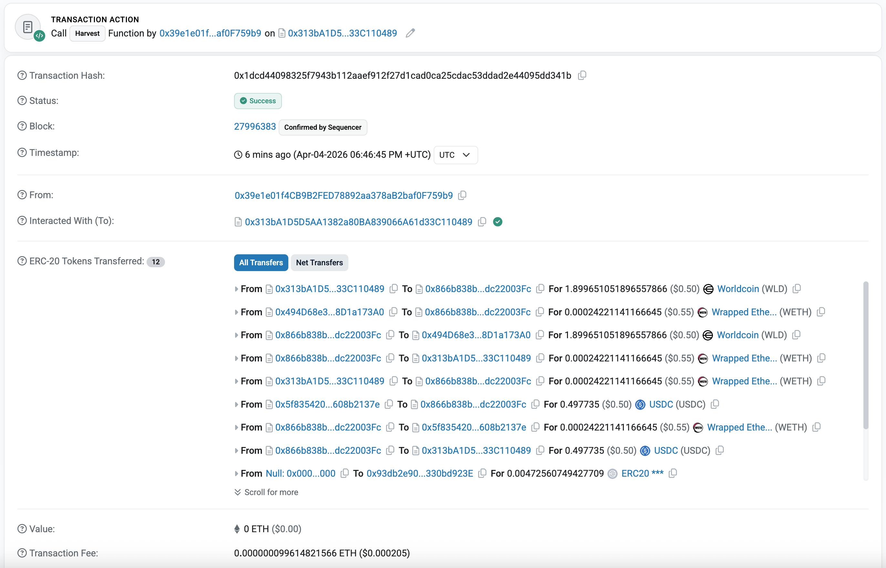

# Harvest — DeFi, for Humans

**The first yield aggregator on World Chain.** Auto-compounds Morpho vault rewards for all depositors. Every depositor is a verified unique human.

Built for ETHGlobal Cannes 2026.

---

## The Problem

There is $42.7M sitting in DeFi on World Chain right now. Users deposit into Morpho vaults, earn yield, and then... nothing happens. Rewards pile up unclaimed in Merkl. Nobody auto-compounds. And here's the thing — there is no Beefy on World Chain. No Yearn. No yield aggregator of any kind. DeFiLlama confirms it: zero.

Today, if a thousand Morpho users want to claim their rewards, that's a thousand separate transactions — a thousand people doing the same thing individually.

World Chain has 25 million verified humans. None of them are getting compounded yield.

## The Solution

Harvest is a yield aggregator built natively for World Chain. Deposit once. An AI agent does the rest.

Under the hood: we forked Beefy Finance's battle-tested vault contracts (MIT, $billions TVL across 25+ chains), brought that infrastructure to World Chain, and plugged in an AgentKit-powered strategist that claims Merkl rewards, swaps them back to your deposit token, and redeposits — all in a single transaction. One agent harvest benefits every depositor simultaneously.

- **World ID gates deposits.** Only Orb-verified humans can deposit. No bots. No sybil farming of vault yields.
- **AgentKit runs the strategy.** Human-backed agents can also participate, proven via AgentBook — the vault cryptographically distinguishes human-backed automation from anonymous scripts.
- **One harvest, everyone benefits.** 1 agent transaction replaces N individual claims.

## The Vision

Harvest v1 is a USDC yield aggregator. But the architecture is a foundation for something bigger.

**What this becomes with more time:**

A DeFi super-app for World App's 25M users — the first yield optimizer that knows who its users are, and optimizes for them specifically.

Imagine a single app where you set your risk profile — conservative, balanced, or aggressive — and an agent continuously rotates your capital between:

- **Morpho vault markets** — lending yield on USDC, WETH, WLD, WBTC, EURC
- **Uniswap V3 LP positions** — fee revenue on concentrated liquidity ranges
- **Merkl incentive programs** — bonus WLD and MORPHO rewards layered on top

The agent monitors APYs across all venues in real time, rebalances when spreads are meaningful, claims rewards, and compounds back in — all without the user touching anything after the initial deposit.

Because every depositor is World ID-verified, the vault has a property no other protocol on any chain has: **a cryptographic guarantee that every dollar traces back to a unique human.** That's not just a feature. It makes the vault safe for incentive programs, airdrops, and reward distributions that would otherwise be gamed into the ground by bots.

The agent layer compounds this. As AgentKit matures, Harvest can offer opt-in yield strategies where verified humans delegate to AI agents that have proven human backing — a new primitive where the trust guarantees of World ID extend into autonomous financial management.

This is what "DeFi, for humans" actually means at scale.

## What We Built (Hackathon Scope)

| Component | Status |
|-----------|--------|
| BeefyVaultV7 + StrategyMorpho on World Chain mainnet | Deployed |
| World ID deposit gate (Orb-verified humans only) | Implemented |
| AgentKit harvester — claims Merkl, swaps WLD→USDC, redeposits | Implemented |
| Uniswap Trading API — pre-harvest swap quotes + profitability gating | Implemented |
| Next.js 15 World Mini App with MiniKit 2.0 | Deployed |
| Permit2 atomic approve+deposit | Implemented |
| Terminal UI with progressive disclosure | Implemented |

**USDC vault only for v1.** Multi-asset, multi-strategy, and risk-profile routing are the roadmap.

**On the roadmap: World ID v4 on-chain verification.** We wanted to enforce humanness maximally by verifying World ID proofs directly on-chain via the World ID Router contract — no backend trust assumption, the vault contract itself rejects non-humans. We built toward this in [#46](https://github.com/ElliotFriedman/harvest-world/pull/46) but ran into World ID v4 / IDKit compatibility constraints during the hackathon and fell back to backend verification. Full on-chain v4 enforcement is the next milestone.

## Architecture

```
app/          Next.js 15 World Mini App (terminal UI, MiniKit 2.0)
contracts/    Foundry — BeefyVaultV7 + StrategyMorpho (forked from Beefy Finance, MIT)
agent/        TypeScript harvester cron (AgentKit + x402)
docs/         Product spec, technical design, pitch, infra
```

## Key Stats

- World Chain: $42.7M TVL, 25M+ verified users, zero yield aggregators before Harvest
- Morpho Re7 USDC: ~4.15% base APY + Merkl WLD rewards on top
- Auto-compound math: weekly compounding 4.15% → 4.23% effective APY
- Gas savings: 1 harvest transaction replaces N individual claim transactions (N = depositors)

## Key Contracts (World Chain, chainId 480)

| Contract | Address |
|----------|---------|
| Harvest Vault (mooWorldMorphoUSDC) | `0xDA3cF80dC04F527563a40Ce17A5466d6A05eefBD` |
| Morpho Re7 USDC Vault | `0xb1E80387EbE53Ff75a89736097D34dC8D9E9045B` |
| USDC.e (Bridged USDC) | `0x79A02482A880bCE3F13e09Da970dC34db4CD24d1` |
| Merkl Distributor | `0x3Ef3D8bA38EBe18DB133cEc108f4D14CE00Dd9Ae` |
| World ID Router | `0x17B354dD2595411ff79041f930e491A4Df39A278` |
| Permit2 | `0x000000000022D473030F116dDEE9F6B43aC78BA3` |

## Prize Targets

| Track | Prize | How we win |
|-------|-------|-----------|
| Best Use of AgentKit | $8,000 | Agent IS the strategist — claims, swaps, redeposits autonomously using AgentKit + x402 |
| Best Use of World ID | $8,000 | World ID gates deposits. Only Orb-verified humans. Sybil-proof vault. |
| Best Use of MiniKit | $4,000 | Permit2 atomic approve+deposit, walletAuth, IDKit verify — deep MiniKit integration |
| Best Uniswap API Integration | $10,000 | Agent uses Uniswap Trading API for swap intelligence — quotes WLD→USDC before harvest, gates on profitability |

## Demo

Open Harvest in World App → verify human (World ID orb) → `vaults` → `deposit 50 usdc` → `portfolio` → `agent status` (shows Uniswap swap estimate) → `agent harvest` (quotes WLD→USDC via Uniswap API before executing)

## Contracts

Forked from [beefyfinance/beefy-contracts](https://github.com/beefyfinance/beefy-contracts) (MIT licensed, battle-tested, $billions TVL). Modifications: World ID deposit gate, Permit2 transfer path, Uniswap V3 swap routing for World Chain. The agent uses the [Uniswap Trading API](https://hub.uniswap.org) for swap intelligence — quoting WLD→USDC before each harvest to verify profitability.

## Docs

| Doc | Purpose |
|-----|---------|
| [Product Spec](docs/product-spec.md) | Full feature spec — screens, commands, vault logic, demo flow |
| [Technical Design](docs/technical-design.md) | API routes, contract interfaces, MiniKit integration, agent code |
| [Contract Spec](docs/contract-spec.md) | BeefyVaultV7 + StrategyMorpho — modifications, interfaces, deployment |
| [Pitch](docs/pitch.md) | Word-for-word pitch script, demo storyboard, judge Q&A |
| [Brand Book](docs/brand-book.md) | Visual identity — terminal aesthetic, typography, color, copy tone |
| [Cloud Architecture](docs/cloud-architecture.md) | Hosting, deployment, agent runtime, infra decisions |
| [AgentBook Integration](docs/agentbook-integration.md) | How the vault verifies human-backed agents via AgentKit |
| [Infra Checklist](docs/infra-checklist.md) | Setup tasks — Developer Portal, wallets, Vercel, Supabase |
| [Security Audit](docs/security-audit.md) | On-chain state verification, API surface, deployment hygiene |

---

## Proof of Work

This section exists for one reason: to show judges we went all-in.

### Development Velocity

| Metric | Count |
|--------|-------|
| Total commits | **160** |
| Merged pull requests | **94** |
| GitHub issues tracked | **90+** |
| Lines of code (Solidity + TypeScript) | **3,020** |
| Build window | **36 hours** (ETHGlobal Cannes, Apr 3–5 2026) |

[View commit frequency →](https://github.com/ElliotFriedman/harvest-world/graphs/commit-activity)

**Timeline:**
- **Friday midnight** — contracts forked, stripped, and deployed to World Chain mainnet
- **Saturday noon** — full mini app running end-to-end with deposit and World ID verification
- **Saturday evening** — AgentKit harvester live, Uniswap Trading API integrated, streaming yield display shipped
- **Sunday 5AM** — security audit + Certora specs completed

---

### Merged Pull Requests

<details>
<summary>94 merged PRs across 9 categories — click to expand</summary>

#### Infrastructure & CI
| PR | Description |
|----|-------------|
| [#25](https://github.com/ElliotFriedman/harvest-world/pull/25) | docs: add and clean up docs directory |
| [#28](https://github.com/ElliotFriedman/harvest-world/pull/28) | feat: test infrastructure with shared deployer library and CI |
| [#32](https://github.com/ElliotFriedman/harvest-world/pull/32) | feat: deploy contracts to World Chain mainnet |
| [#39](https://github.com/ElliotFriedman/harvest-world/pull/39) | ci: add app install + build jobs to CI pipeline |
| [#46](https://github.com/ElliotFriedman/harvest-world/pull/46) | docs: add README |

#### Contracts — Beefy Fork + World Chain
| PR | Description |
|----|-------------|
| [#26](https://github.com/ElliotFriedman/harvest-world/pull/26) | feat: sybil resistance, Permit2 deposits, World ID + test infra |
| [#27](https://github.com/ElliotFriedman/harvest-world/pull/27) | cleanup: local branch cleanup |
| [#29](https://github.com/ElliotFriedman/harvest-world/pull/29) | feat: allow human-backed agents to deposit via AgentBook |
| [#30](https://github.com/ElliotFriedman/harvest-world/pull/30) | fix: access control hardening for withdraw and harvest |
| [#31](https://github.com/ElliotFriedman/harvest-world/pull/31) | fmt: formatting pass |
| [#33](https://github.com/ElliotFriedman/harvest-world/pull/33) | add: deployed contract addresses to spec |
| [#50](https://github.com/ElliotFriedman/harvest-world/pull/50) | remove: on-chain human verification from vault |
| [#51](https://github.com/ElliotFriedman/harvest-world/pull/51) | fix: add Multicall3 address to fix portfolio 500 error |
| [#52](https://github.com/ElliotFriedman/harvest-world/pull/52) | feat: TransparentUpgradeableProxy for vault, strategy, and swapper |
| [#53](https://github.com/ElliotFriedman/harvest-world/pull/53) | fix: atomic proxy init in HarvestDeployer + rename Moo → Harvest |

#### World ID Integration
| PR | Description |
|----|-------------|
| [#38](https://github.com/ElliotFriedman/harvest-world/pull/38) | fix: progressive disclosure + connect wallet button |
| [#41](https://github.com/ElliotFriedman/harvest-world/pull/41) | fix: require wallet before deposit to prevent ProofInvalid |
| [#44](https://github.com/ElliotFriedman/harvest-world/pull/44) | fix: signal staleness bug + single-tap get started flow |
| [#47](https://github.com/ElliotFriedman/harvest-world/pull/47) | fix: ABI-decode World ID proof (root cause of simulation_failed) |
| [#48](https://github.com/ElliotFriedman/harvest-world/pull/48) | debug: exhaustive logging to diagnose simulation_failed |
| [#49](https://github.com/ElliotFriedman/harvest-world/pull/49) | fix: downgrade IDKit to v2 for V3-compatible on-chain World ID proofs |

#### Permit2 Debugging (11 iterations to mainnet)
| PR | Description |
|----|-------------|
| [#54](https://github.com/ElliotFriedman/harvest-world/pull/54) | fix: Permit2 allowance expiration causing deposit revert |
| [#55](https://github.com/ElliotFriedman/harvest-world/pull/55) | fix: lazy-load IDKit to prevent white screen in World App |
| [#56](https://github.com/ElliotFriedman/harvest-world/pull/56) | fix: set Permit2 expiration to 0 per World docs |
| [#59](https://github.com/ElliotFriedman/harvest-world/pull/59) | fix: Permit2 expiration timestamp, bump v1.6 |
| [#60](https://github.com/ElliotFriedman/harvest-world/pull/60) | fix: reduce Permit2 expiration to 15s, bump v1.7 |
| [#62](https://github.com/ElliotFriedman/harvest-world/pull/62) | fix: Permit2 expiration to current timestamp, bump v1.8 |
| [#63](https://github.com/ElliotFriedman/harvest-world/pull/63) | fix: balance-aware deposit picker, guard against insufficient funds |
| [#64](https://github.com/ElliotFriedman/harvest-world/pull/64) | fix: Permit2 expiration now+2s, bump v1.9 |
| [#66](https://github.com/ElliotFriedman/harvest-world/pull/66) | debug: Permit2 expiration=0 for Tenderly trace, bump v2.0 |
| [#67](https://github.com/ElliotFriedman/harvest-world/pull/67) | fix: correct vault address + restore Permit2 expiration, v2.1 |
| [#71](https://github.com/ElliotFriedman/harvest-world/pull/71) | fix: set Permit2 expiration to 0 per World docs (final) |

#### Mini App & Terminal UI
| PR | Description |
|----|-------------|
| [#34](https://github.com/ElliotFriedman/harvest-world/pull/34) | feat: functional mini app with deposit, withdraw, portfolio |
| [#42](https://github.com/ElliotFriedman/harvest-world/pull/42) | fix: compact vaults display for mobile |
| [#43](https://github.com/ElliotFriedman/harvest-world/pull/43) | fix: add brand assets and metadata to Next.js app |
| [#57](https://github.com/ElliotFriedman/harvest-world/pull/57) | fix: rename vault shares label to hvUSDC, bump version to v1.5 |
| [#58](https://github.com/ElliotFriedman/harvest-world/pull/58) | docs: remove Supabase, update constraints, add brand assets |
| [#70](https://github.com/ElliotFriedman/harvest-world/pull/70) | feat: easter egg with typewriter animation |

#### Agent & Harvester
| PR | Description |
|----|-------------|
| [#45](https://github.com/ElliotFriedman/harvest-world/pull/45) | feat: implement harvester agent API + terminal commands |
| [#69](https://github.com/ElliotFriedman/harvest-world/pull/69) | fix: wire agent status to real Merkl API, fix addresses |
| [#73](https://github.com/ElliotFriedman/harvest-world/pull/73) | fix: wire agent status/harvest to real API, fix harvester addresses, v2.3 |
| [#74](https://github.com/ElliotFriedman/harvest-world/pull/74) | feat: show total USD value as wallet USDC + vault shares |
| [#76](https://github.com/ElliotFriedman/harvest-world/pull/76) | feat: AgentKit harvester + burner wallet setup |

#### Features
| PR | Description |
|----|-------------|
| [#91](https://github.com/ElliotFriedman/harvest-world/pull/91) | feat: integrate Uniswap Trading API for swap intelligence |
| [#92](https://github.com/ElliotFriedman/harvest-world/pull/92) | feat: show streaming yield unlock countdown in agent status |
| [#95](https://github.com/ElliotFriedman/harvest-world/pull/95) | feat: observer mode boot sequence, QR deeplink, 4 new terminal commands (gm, oracle, roots, scan) |

#### Fixes & Polish
| PR | Description |
|----|-------------|
| [#96](https://github.com/ElliotFriedman/harvest-world/pull/96) | fix: observer mode only on desktop (250ms MiniKit init delay), copy button, v2.5 |

#### Security & Docs
| PR | Description |
|----|-------------|
| [#86](https://github.com/ElliotFriedman/harvest-world/pull/86) | docs: internal security audit |
| [#93](https://github.com/ElliotFriedman/harvest-world/pull/93) | docs: add README, CLAUDE.md, Claude skills config |
| [#94](https://github.com/ElliotFriedman/harvest-world/pull/94) | docs: add Proof of Work section to README |

</details>

---

### Issues: Done vs. Roadmap

#### Completed

| Issue | Description |
|-------|-------------|
| [#1](https://github.com/ElliotFriedman/harvest-world/issues/1) | Set up World Developer Portal app |
| [#2](https://github.com/ElliotFriedman/harvest-world/issues/2) | Set up deployer + agent wallets |
| [#3](https://github.com/ElliotFriedman/harvest-world/issues/3) | Set up Vercel + environment |
| [#4](https://github.com/ElliotFriedman/harvest-world/issues/4) | Fork Beefy contracts and strip for World Chain |
| [#5](https://github.com/ElliotFriedman/harvest-world/issues/5) | Deploy contracts to World Chain mainnet |
| [#6](https://github.com/ElliotFriedman/harvest-world/issues/6) | Write and run contract tests |
| [#7](https://github.com/ElliotFriedman/harvest-world/issues/7) | Scaffold Next.js mini app + terminal UI shell |
| [#8](https://github.com/ElliotFriedman/harvest-world/issues/8) | Implement World ID + wallet auth in terminal |
| [#9](https://github.com/ElliotFriedman/harvest-world/issues/9) | Implement terminal commands: portfolio, vaults |
| [#10](https://github.com/ElliotFriedman/harvest-world/issues/10) | Implement terminal commands: deposit, withdraw |
| [#11](https://github.com/ElliotFriedman/harvest-world/issues/11) | Build harvester agent (cron + harvest call) |
| [#12](https://github.com/ElliotFriedman/harvest-world/issues/12) | Integrate AgentKit for agent identity |
| [#19](https://github.com/ElliotFriedman/harvest-world/issues/19) | Set up domain name + live deployment for judges |
| [#24](https://github.com/ElliotFriedman/harvest-world/issues/24) | Implement AgentKit deposit gate for human-backed agents |
| [#35](https://github.com/ElliotFriedman/harvest-world/issues/35) | Verify portfolio decimal math with real deposit |

#### Roadmap

**Security hardening (all findings tracked from internal audit):**
[#78](https://github.com/ElliotFriedman/harvest-world/issues/78) strategy owner EOA ·
[#79](https://github.com/ElliotFriedman/harvest-world/issues/79) slippage protection ·
[#80](https://github.com/ElliotFriedman/harvest-world/issues/80) claim() access control ·
[#81](https://github.com/ElliotFriedman/harvest-world/issues/81) isolate AGENT_PRIVATE_KEY ·
[#82](https://github.com/ElliotFriedman/harvest-world/issues/82) harden API endpoints ·
[#83](https://github.com/ElliotFriedman/harvest-world/issues/83) stale address references ·
[#84](https://github.com/ElliotFriedman/harvest-world/issues/84) reentrancy guard + timelock ·
[#85](https://github.com/ElliotFriedman/harvest-world/issues/85) deployment hygiene

**Stretch features:**
[#17](https://github.com/ElliotFriedman/harvest-world/issues/17) WLD vault ·
[#21](https://github.com/ElliotFriedman/harvest-world/issues/21) harvest notifications ·
[#23](https://github.com/ElliotFriedman/harvest-world/issues/23) DeFiLlama TVL adapter ·
[#37](https://github.com/ElliotFriedman/harvest-world/issues/37) multi-vault architecture ·
[#75](https://github.com/ElliotFriedman/harvest-world/issues/75) permissionless harvesting via on-chain AgentKit gating

---

### Deep On-Chain Investigation

We didn't guess at hard problems — we instrumented them and found the root cause.

**World ID V3/V4 Incompatibility** — [`docs/verify-simulation-failure-root-cause.md`](docs/verify-simulation-failure-root-cause.md)

8 PRs (plus a [public help request](https://github.com/ElliotFriedman/harvest-world/pull/65)) debugging `simulation_failed` on `verifyHuman()`. We probed the WorldIDRouter on-chain via `cast`, discovered the World Chain V4 verifier only maintains 7-day rolling V4 Merkle roots (never imported V3 roots), and confirmed the exact failure mode by testing with the live registered root (`0x082d67...`): using the correct root with a fake proof yields `ProofInvalid()` — a different error — proving the root check passes when fed a V4 root. The V3 root from `orbLegacy()` gives `NonExistentRoot()` because it's from a different Merkle tree entirely. Full write-up with on-chain evidence, error selectors, and fix options documents why each candidate fix was ruled out.

**Permit2 Expiration** — 11 PRs, each deployed and tested live on World Chain mainnet, iterating through every documented expiration value (0, 2s, 15s, 60s, 24h, current timestamp) until finding the one the `sendTransaction` simulation accepts.

---

### Security

**AI-Powered Internal Security Audit** — [`docs/security-audit.md`](docs/security-audit.md)

A team of review agents audited the deployed system across three surfaces: on-chain contract state (all 3 proxy contracts verified via `cast` against Alchemy RPC), off-chain API surface (all Next.js routes), and deployment hygiene. Every finding is documented with a specific file path, line number, on-chain evidence, and a production remediation path.

| Severity | Count |
|----------|-------|
| MEDIUM | 8 |
| LOW | 13 |
| INFO | 5 |

All 26 findings are acknowledged and tracked as GitHub issues [#78](https://github.com/ElliotFriedman/harvest-world/issues/78)–[#85](https://github.com/ElliotFriedman/harvest-world/issues/85).

---

**Certora Formal Verification** — branch [`feat/certora-formal-specs`](https://github.com/ElliotFriedman/harvest-world/tree/feat/certora-formal-specs) | [PR #93](https://github.com/ElliotFriedman/harvest-world/pull/93)

We wrote Certora Prover specs (CVL2) for the 3 core contracts. Formal verification uses SMT solvers to mathematically prove properties hold for every possible input in every reachable state — not just the cases unit tests happen to cover. **30 properties verified, all passing.**

| Contract | Spec | Passing | Dashboard |
|----------|------|---------|-----------|
| `BeefyVaultV7` | `certora/specs/BeefyVaultV7.spec` | **15/15** | [Certora Report](https://prover.certora.com/output/651303/496832330da84903aebb2e06001116bd?anonymousKey=e0cc398a4f028ec7d493cbdbf5c4938ad2a6fb6e) |
| `BaseAllToNativeFactoryStrat` | `certora/specs/BaseStrategy.spec` | **10/10** | [Certora Report](https://prover.certora.com/output/651303/96851137a8f04b30a2b5a2aa845711a8?anonymousKey=bf48592a43f3083fe687d9db12f2971fb14ff264) |
| `StrategyMorphoMerkl` | `certora/specs/StrategyMorphoMerkl.spec` | **5/5** | |

Key properties proven: share minting/burning correctness, deposit-withdraw round-trip safety, price-per-share monotonicity under yield, locked profit decay, manager/owner access control, reward token safety.

Each contract has a harness (exposing internal state as external views), mock contracts (Morpho vault, Merkl claimer, ERC-20), and a `.conf` file for the Certora cloud runner. Run all: `bash certora/run_all.sh`

**Onchain Harvest Proof** — [`0x1dcd4409...`](https://worldscan.org/tx/0x1dcd44098325f7943b112aaef912f27d1cad0ca25cdac53ddad2e44095dd341b)

Real harvest transaction on World Chain: `harvest()` → WLD→WETH (0.3% pool) → WETH→USDC (0.05% pool) via Uniswap V3 SwapRouter02 → deposit into Morpho vault. 12 ERC-20 transfers in a single atomic transaction. Tracked in [#88](https://github.com/ElliotFriedman/harvest-world/issues/88).



---

### AI Tooling Used in Development

We used first-party AI tooling from both prize sponsors as active development infrastructure — not just for code completion.

- **World MCP Server** — queried World ID docs, verified contract addresses, and retrieved integration guidance in-IDE throughout the entire build
- **Uniswap MCP + AI Skill** — used for Uniswap V3 swap route design, Trading API integration, and WLD→USDC path configuration

```bash
# Uniswap AI skill used during development
npx skills add uniswap/uniswap-ai --skill swap-integration
```

---

*There's at least one easter egg hidden in the terminal. You'll know it when you find it.*
